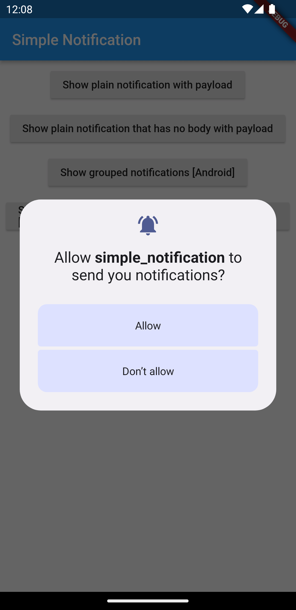
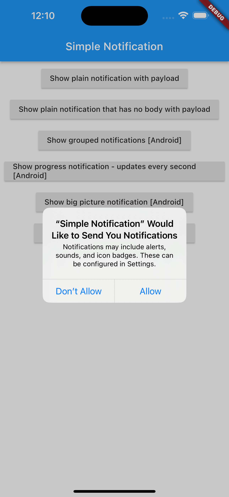
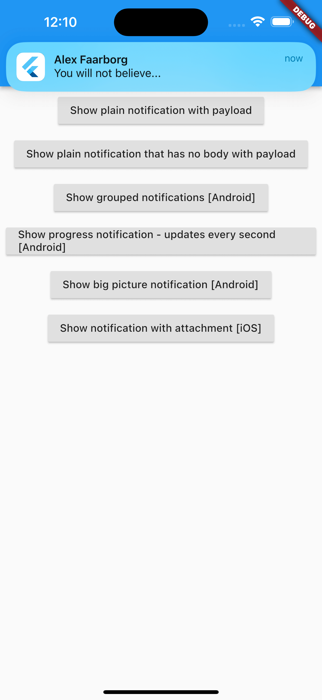

## Description

Projek ini merupakan latihan menampilkan notifikasi sederhana dengan menggunakan beberapa package seperti [flutter_local_notifications](https://pub.dev/packages/flutter_local_notifications) [rxdart](https://pub.dev/packages/rxdart) [http](https://pub.dev/packages/http) dan [path_provider](https://pub.dev/packages/path_provider). Dalam project ini terdapat beberapa poin latihan notifikasi seperti :
1. Membuat notifikasi secara sederhana.
2. Membuat berbagai macam jenis notifikasi.
3. Mengarahkan notifikasi ke halaman tertentu ketika di klik dan mengirimkan data.

## Development Setup

Clone the repository and run the following commands:

```
flutter pub get
flutter run
```

## Source

Dicoding Academy

## Screenshot Platform Android

 &nbsp; 

## Screenshot Platform iOS

 &nbsp; 